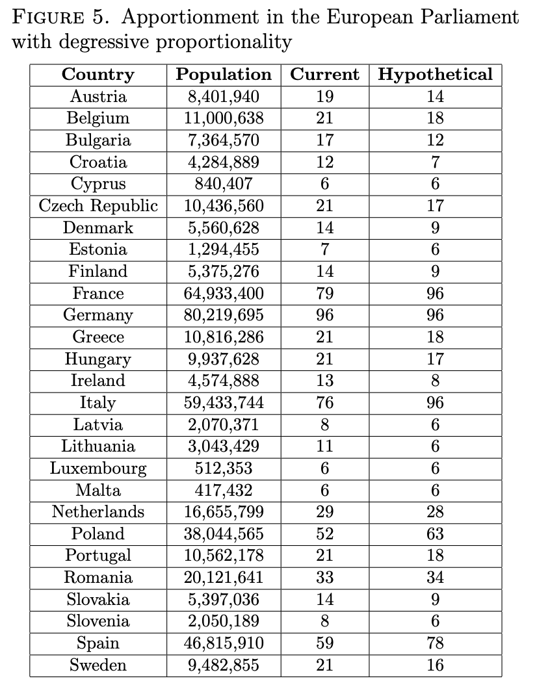

# Adaptation of the Huntington method for the EU
There are two approaches we can take when adapting Huntington's method. 

The first is to completely ignore the principle of degressive proportionality and give every state near equal representation in the European Parliament. Taking this approach would lead us to a Parliament which looks more like the US House of Representatives. 
The second approach is to keep the principle of degressive proportionality but grant every member state an m minimum number of seats,  and allocate the remaining seats using Huntington's method subject to a maximum of 96 seats. After a member state reaches 96 seats, it shall be assigned no more seats. These guidelines were established [Gri12, Page 3]. 
  
## Ignoring degressive proportionality 
If we wish to ignore the principle of degressive proportionality, we will get a result, where every member state has roughly equal representation. This will give us a result that gives the more populous member states (such as Germany and France) a lot more power when compared to the current system. The results, if we applied the different methods using the Python program, can be found in Table 4. 

When comparing the apportionment data between the three methods, we can only see a difference in the case of two states. The method of the arithmetic mean assigns one seat fewer to Cyprus, and one more to Germany than the other two methods. Cyprus is one of the least populous states in the European Union, and Germany is the most populous. This also highlights that the method of the arithmetic mean favours larger states over smaller states. 
As we no longer use the principle of degressive proportionality, we can see the effects of the removal of the cap on the number of representatives. Germany and France have crossed the 96 seat-threshold currently used during apportionment, with Italy coming close at 95 seats. 
The minimum number of seats assigned to a state has also been lowered to one. This also causes significant differences and gives less power to the smaller states. 
From these results, it is clear why the principle of degressive proportionality is crucial in the balance between the power of a member state, and the power of the people living in the European Union. Using this system, the four most populous states alone would have a sizeable 402-seat (or 403-seat) majority. 

## Keeping degressive proportionality
We will use a version of the Python code modified according to the guidelines in [Gri12, Page 3]. The code along with a full, line-by-line explanation can be found in section 4.2. Using census data from 2011 from across the European Union, we have arrived at the following composition using the different methods (see Table 5). 
Using this data, we can see that all three methods generated the same results. When analysing the difference between our apportionment and the official apportionment, we can notice a few major differences. 
As this simulation respects degressive proportionality, we can say that the least populous member states benefited greatly from this apportionment. We also see that there are more states with the minimum number of seats than under the current system. 
The only member state that reached the maximum of 96 seats under the current system is Germany. Germany reached this threshold under our system as well, making Germany less represented than the smaller states. 
We can also see that a larger number of states reached 96 seats. These states were already populous, so we can say that this system benefits the larger states as well. 
Another significant statement that we can make after looking the data is that the medium-sized states were the biggest losers of our system. They lost seats at the expense of larger states. 

## Sources
[Gri12] 	G. R. Grimmett, European apportionment via the cambridge compromise, Mathematical Social Sciences 63 (2012), no. 2, 68–73, Around the Cambridge Compromise: Apportionment in Theory and Practice. 