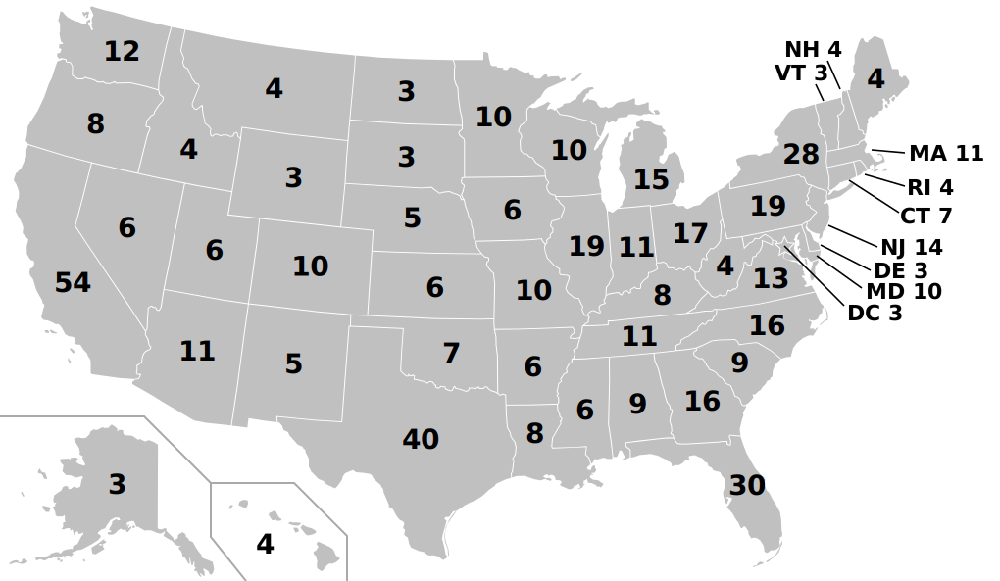
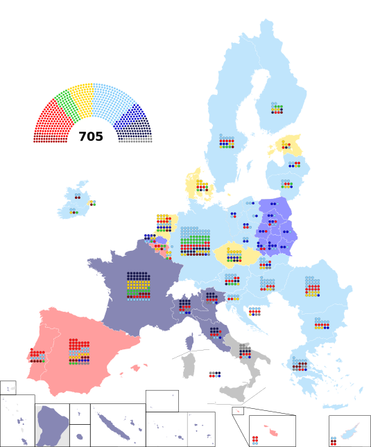

# Context
## The history
If we wish to understand the apportionment systems of Europe and the US, I think it is crucial that we learn a bit about the history first, as the creators of both systems had very different goals when designing their system, and we can find their reasons by looking at the history of these electoral systems.

### United States
After the foundation of the United States in 1776, the Founding Fathers needed to establish a method for choosing the officeholders in the different branches of government. 

The keyword when looking at the history American electoral system is "compromise". The founders needed to resolve the conflict between the smaller and larger states. The small states wanted each state to be equally represented in the decision-making, while the large states wanted representation to be proportional to the population. The result of this compromise was a bicameral legislature. In the Senate, every state has two senators, thus giving the smaller states a lot of power in the legislative process. In the House of Representatives, each state has a certain number of representatives proportional to its population, with each state having at least one seat in the House. The US constitution requires that the seats assigned to each state be proportional to its population, but it doesn't specify any method to use for apportionment. 

The method for electing the executive is derived from the method for electing the legislature. The President is not directly elected by the people, rather by the Electoral College. According to this system, each state is assigned a certain number of electors, who will vote according to the will of the voters. Each state is assigned the same number of electors as seats in the Congress (representatives + senators). Most states award all of their electors to the candidate who received the most votes in their state. To win the election, a candidate needs the votes of a majority of all electors.

### European Union
The President of the European Commission is the most powerful official in the European Union. This position is comparable to prime ministers in parliamentary democracies or presidents in presidential republics.

The election of the President is a contentious issue after every European election. To resolve this issue, the Spitzenkandidaten system was developed. According to this system, the person nominated by the party with the most seats in the European Parliament will become the President of the European Commission. This system was last used in 2014, when Jean-Claude Juncker of the European People's Party was elected President, after the centre-right party won a plurality of seats in the European Parliament.

The equivalent document of the US Constitution for the European Union which establishes the branches of government is the Treaty of Lisbon. It establishes the European Parliament as the primary legislative institution of the EU. Like the US Constitution, the Treaty does not specify the apportionment method, but it does set some guidelines. The document establishes the 705-seats of the European Parliament. It gives every member state at least six, and at most 96 seats in the Parliament.

## The system
Now that we know a bit about why these systems were created the way they were, we can now take a look at how these systems work.

### United States

The apportionment system of the European 

### European Union

The Treaty also requires any apportionment method to adhere to the principle of degressive proportionality. The guidelines for the current method of apportionment were described in the Cambridge compromise, which was finalised at the Cambridge Apportionment Meeting (CAM). (see \cite[Page1]{Grimmett2012}, \cite{Grimmett2017})
#### The principle of degressive proportionality
Degressive proportionality means "the ratio between the population and the number of seats of each Member State must vary in relation to their respective populations in such a way that each Member from a more populous Member State represents more citizens than each Member from a less populous Member State and conversely, but also that no less populous Member State has more seats than a more populous Member State." (this is known as the Lamassoure-Severin definition, see \cite[Page 2]{Grimmett2012})

The following requirements were devised at the Cambridge Apportionment Meeting:

- "no smaller State shall receive more seats than a larger State,"
- "the ratio population/seats shall increase as population increases."

At the time, it seemed impossible to design a system that satisfies both requirements under the hypotheticals tested. This resulted in the modification of the Lamassoure-Severin definition. After the amendment, it defined degressive proportionality as follows: "the ratio between the population and the number of seats of each Member State before rounding to whole numbers must vary in relation to their respective populations in such a way that each Member from a more populous Member State represents more citizens than each Member from a less populous Member State and conversely, but also that no less populous Member State has more seats than a more populous Member State."

After the definition was amended, the Cambridge Apportionment Meeting developed the base + prop method for apportionment.

#### Base + prop method

The base + prop method for apportionment consists of two stages, as written in \cite[Page 2-3]{Grimmett2012}:

- The allocation of a fixed (base) number of states to each member state.
- The allocation of the remaining states in proportion to the member state's population (subject to rounding and capping at the maximum).

To achieve the desired size for the Parliament, a house-size divisor is introduced. Using the given base $b$, maximum $M$ and divisor $d$, we can define the following allocation function $A_d: [0, \infty) \to [0, \infty)$:
$$
A_d (p) = \min \left\{ b + \frac{p}{d}, M \right\}
$$
We shall assign the seat share $A_d (p)$ to the member state with population $p$. After that, we need to round this to an integer, and adjust the divisor $d$, so that the sum of the seat numbers equals the desired Parliament size. 

The Cambridge Apportionment Meeting recommended the use of base $b = 5$, and the use of upwards rounding.