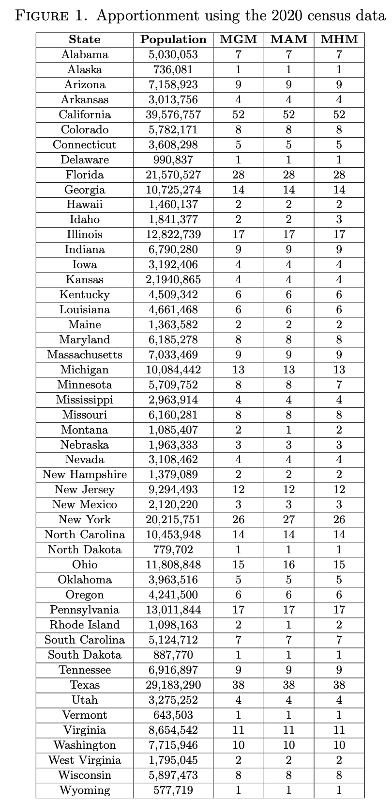

# The Huntington method
The current method of apportionment was developed by an American mathematician, Edward V. Huntington in the early 20th century. The method was described in \cite{Huntington1928}, \cite{Huntington1928}, \cite{Sullivan1972} and \cite{Sullivan1982}.

## The requirements for the system
Huntington determined, that given two states, which have populations $A$ and $B$ respectively, have $a$ and $b$ seats in the House, the perfect system would give a result where

$$
\frac{A}{a} = \frac{B}{b} \text{.}
$$

As it would be basically impossible to satisfy this equation in a representative democracy, Huntington's goal was to make this inequality as small as possible.

## The absolute difference and the relative difference
A crucial question in developing the system was whether to use the absolute or the relative difference for the apportionment process. For example, if there are two districts, one with a population of 1,000 and another one with 1,001 people, the absolute difference here is 1, and the relative difference is 0.1\%, but if two districts have a population of 10 and 11, the absolute difference would still be 1, but the relative difference would be 10\%. Due to this reason, Huntington recommended the use of the relative difference instead of the absolute one. We can achieve the relative difference between states $A$ and $B$ by calculating $\frac{\frac{A}{a}-\frac{B}{b}}{\frac{B}{b}}$.
\subsubsection{The first test for the method of equal proportions}
Huntington defined the first test for his method (known as the method of equal proportions or the method of the geometric mean, which we will be abbreviating as MGM) as follows (see \cite[Page 3]{Huntington1928}) :

"If the relative difference between the congressional districts, $\frac{A}{a}$ and $\frac{B}{b}$, belonging to any two states can be reduced by a transfer of a representative from one state to the other, then this transfer should be made."

We can write the following "inequality" \footnote{Please note that this is not a "real inequality". We are writing this as an inequality to transform these fractions into the desired form.} for the test:
$$
\frac{\frac{A}{a + 1} - \frac{B}{b}}{\frac{B}{b}} < \frac{\frac{B}{b + 1} - \frac{A}{a}}{\frac{A}{a}}
$$
We rearrange this inequality to get the multiplier that can be used for successive applications of the test: \footnote{We know that the population of a state and the number of representatives assigned to it will be a positive integer, so the direction of the inequality will not change, and we can take the square root of these numbers on the set of real numbers.}
$$
\frac{\frac{A}{a + 1} - \frac{B}{b}}{\frac{B}{b}} < \frac{\frac{B}{b + 1} - \frac{A}{a}}{\frac{A}{a}} \Rightarrow \nonumber \\
\left( \frac{A}{a} \right) \left( \frac{A}{a + 1} - \frac{B}{b} \right) < \left( \frac{B}{b} \right) \left( \frac{B}{b + 1} - \frac{A}{a} \right) \Rightarrow \nonumber \\
\frac{A^2}{a\left( a+1\right) } - \frac{AB}{ab} < \frac{B^2}{b \left( b+1 \right) } - \frac{AB}{ab} \Rightarrow \nonumber \\
\frac{A^2}{a \left( a + 1 \right) } < \frac{B^2}{b \left( b + 1 \right) } \Rightarrow \nonumber \\
\frac{A}{\sqrt{a \left( a + 1 \right) }} < \frac{B}{\sqrt{b \left( b + 1 \right) }}
$$
\subsubsection{The second test for the method of equal proportions}
This is similar to the first one, but instead of the ratio $\frac{A}{a}$, it uses $\frac{a}{A}$. Here, we divide the number of representatives by the population. We can think of this as the "individual share" each person living in the state gets of the representative. In perfect apportionment, the equality would look like this:
$$
    \frac{a}{A} = \frac{b}{B}
$$
Huntington defined the second test as follows(see \cite[Page 4]{Huntington1928}:

"If the relative difference between the two "individual shares", $\frac{a}{A}$ and $\frac{b}{B}$, belonging to any two states, can be reduced by a transfer of a representative from one state to the other, then this transfer should be made."

We can see that the equality in \eqref{E:second_test} is the reciprocal of the one in \eqref{E:requirement}. If we perform transformations as seen in \eqref{E:transform_first_test}, we will arrive at the following inequality (which is also the reciprocal of the one in \eqref{E:transform_first_test}):
$$
\frac{\sqrt{a \left( a + 1 \right) }}{A} < \frac{\sqrt{b \left( b + 1 \right) }}{B}
$$
## Working rule for the method of equal proportions
In \eqref{E:transform_first_test}, we transformed the inequality into the following:
$$
\frac{A}{\sqrt{a \left( a + 1 \right) }} < \frac{B}{\sqrt{b \left( b + 1 \right) }}
$$
As we are dividing the population of a state, we can interpret it as multiplying the population of state $A$ by the following fraction:
$$
\frac{1}{\sqrt{a \left( a + 1 \right)}}
$$
Let's start by writing down the notations we will be using:
- $n$: the number of states
- $r$: the number of representatives that we need to assign
- $A$: the population of state $A$
- $a$: the number of representatives assigned to state $A$

The first thing we need to do is to write down each state, its population and the number of representatives assigned to it. At the start, each state will be assigned one representative. Now we see that we need to perform the procedure $n-r$ times.

Every time we assign a representative, we need to multiply the population of each state by
$$
\frac{1}{\sqrt{a \left( a + 1 \right) }} \text{,}
$$
where $a$ will be the number of representatives the state currently holds (after each iteration). The state that will be assigned the representative will be the state with the highest population after performing the multiplication.
## Alternative methods for apportionment

We can achieve alternative methods for apportionment by slightly modifying the tests defined by Huntington for the method of the geometric mean. By using the absolute difference instead of the relative difference, we can arrive at the method of the harmonic mean and the method of the arithmetic mean. These methods have been described in \cite{Huntington1928}, \cite{Huntington1928} and \cite{Sullivan1972}.
### Method of the arithmetic mean
We can achieve the method of the arithmetic mean (which we will be abbreviating as MAM) by taking the absolute difference between the individual shares of two states. Huntington defined the test for the method of the arithmetic mean (or the method of major fractions) as follows (see \cite[Page 7]{Huntington1928}):

"If the absolute difference between the two "individual shares", $\frac{a}{A}$ and $\frac{b}{B}$, can be reduced by a transfer of a representative from one state to the other, then this transfer should be made (except that no state shall be left without at least one representative)."

We can write the following inequality using this test (using the same notations as before):
$$
\frac{a + 1}{A} - \frac{b}{B} < \frac{b + 1}{B} - \frac{a}{A}
$$
To achieve the working rule for the method of the arithmetic mean, we need to transform the inequality like so:
$$
\frac{a + 1}{A} - \frac{b}{B} < \frac{b + 1}{B} - \frac{a}{A} \Rightarrow \\
\frac{a + 1}{A} + \frac{a}{A} < \frac{b + 1}{B} + \frac{b}{B} \Rightarrow \\
\frac{2a + 1}{A} < \frac{2b + 1}{B}
$$
Taking the reciprocals, we get:
$$
\frac{A}{2a+1} > \frac{B}{2b+1} \Rightarrow \nonumber \\
\frac{A}{a + \frac{1}{2}} > \frac{B}{b + \frac{1}{2}}
$$
From this result, we can see that the multiplier for state $A$ for the method of the arithmetic mean will be:
$$
\frac{1}{a + \frac{1}{2}}
$$
With this multiplier, we can arrive at the working rule for this method, which is similar to that of the method of the geometric mean. We need to perform the same procedure as we did for the method of equal proportions, with the only difference being the multiplier. Instead of using \eqref{E:multiplier}, we shall use \eqref{E:arithmetic_multiplier}. 
### Method of the harmonic mean
We can achieve the method of the harmonic mean (which we will be abbreviating as MHM) by taking the absolute difference between the population of two districts. Huntington defined the test for the method of the harmonic mean as follows (see \cite[Page 7]{Huntington1928}):

"If the absolute difference between the two congressional districts $\frac{A}{a}$ and $\frac{B}{b}$, can be reduced by a transfer of a representative from one state to the other, then this transfer should be made."

We can write the following inequality using this test (using the same notations as before):
$$
\frac{A}{a+1} - \frac{B}{b} < \frac{B}{b+1} - \frac{A}{a}
$$
To achieve the working rule for the method of the arithmetic mean, we need to transform the inequality like so:
$$
\frac{A}{a+1} - \frac{B}{b} < \frac{B}{b+1} - \frac{A}{a} \Rightarrow \nonumber \\
\frac{A}{a+1} + \frac{A}{a} < \frac{B}{b+1} + \frac{B}{b} \Rightarrow \nonumber \\
A \left( \frac{1}{a+1} + \frac{1}{a} \right) < B \left( \frac{1}{b+1} + \frac{1}{b} \right) \Rightarrow \nonumber \\
A \left( \frac{a}{a(a+1)} + \frac{a+1}{a(a+1)} \right) < B \left( \frac{b}{b(b+1)} + \frac{b+1}{b(b+1)} \right) \Rightarrow \nonumber \\
A \left( \frac{2a+1}{a(a+1)} \right) < B \left( \frac{2b+1}{b(b+1)} \right) \Rightarrow \nonumber \\
\frac{A}{\frac{a(a+1)}{2a+1}} < \frac{B}{\frac{b(b+1)}{2b+1}} \Rightarrow \nonumber \\
\frac{A}{2 \cdot \frac{a(a+1)}{2a+1}} < \frac{B}{2 \cdot \frac{a(a+1)}{2b+1}}
$$
From this result, we can see that the multiplier for state $A$ for the method of the harmonic mean will be:
$$
\frac{1}{2 \cdot \frac{a(a+1)}{2a+1}}
$$
With this multiplier, we can arrive at the working rule for this method, which is similar to that of the method of the geometric mean. We need to perform the same procedure as we did for the method of equal proportions, with the only difference being the multiplier. Instead of using \eqref{E:multiplier}, we shall use \eqref{E:harmonic_multiplier}.

## Composition of the US House
The following table shows the apportionment results using the 2020 census data for the three methods previously described.

## Sources
[Hun21] 	E. V. Huntington, A new method of apportionment of representatives, Quarterly Publications of the American Statistical Association 17 (1921), no. 135, 859–870. 

[Hun28] 	E. V. Huntington, The apportionment of representatives in Congress, Trans. Amer. Math. Soc. 30 (1928), no. 1, 85–110. MR 1501423 

[Sul72] 	J. J. Sullivan, The election of a president, The Mathematics Teacher 65 (1972), no. 6, 493–501. 

[Sul82] 	J. J. Sullivan, Apportionment—a decennial problem, The Mathematics Teacher 75 (1982), no. 1, 20–25. 