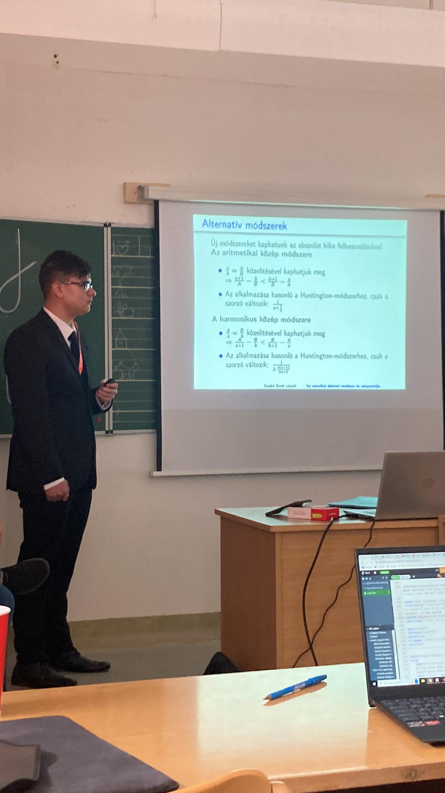
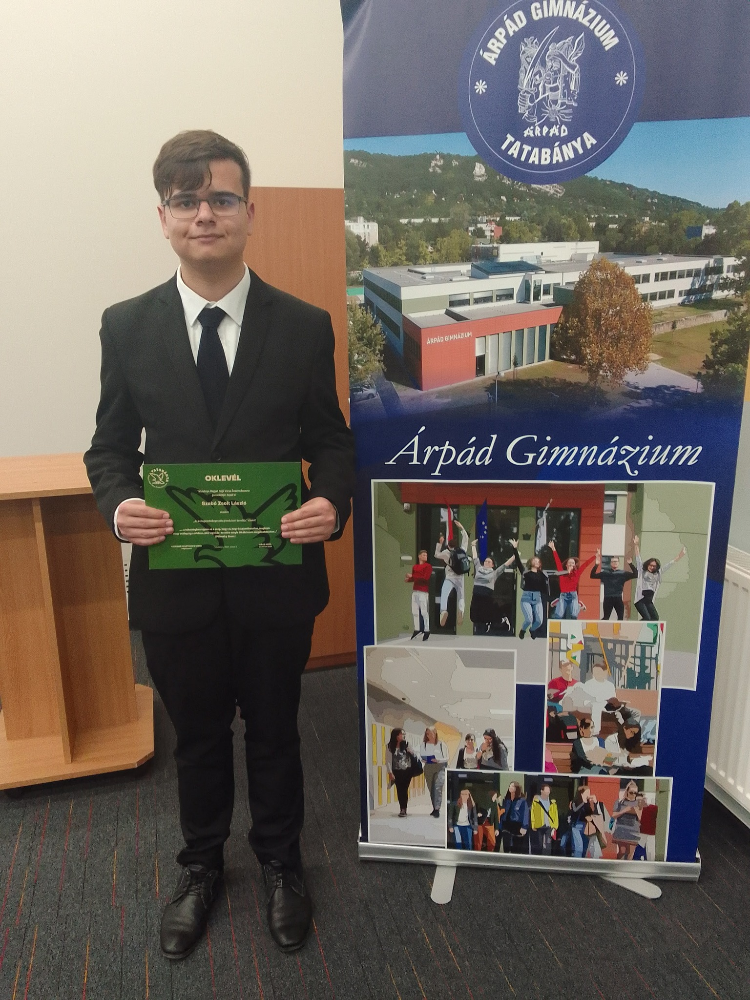

# The American electoral system and its adaptation to the European Union

## About the paper
This paper is the first step in my research into electoral and apportionment systems. I wrote my work under the supervision of Pál Burai, PhD, associate professor of the Institute of Mathematics at the Budapest University of Technology and Economics Faculty of Natural Sciences.

I start my paper with a brief summary of the history of the Electoral College. I then describe how the American apportionment system works. It uses a method designed by American mathematician Edward V. Huntington in the early 20th century, and is still in use today. It uses the method of the geometric mean. I also analyzed how we can modify this method for different mathematical means and what kind of effect this would have on the apportionment.

I also wrote briefly about how elections for the European Parliament work. I adapted Huntington's method and its modified versions to the European elections and analyzed how it would impact the composition of the European Parliament, and which countries would be the biggest winners and losers of such a system.

In the final section, I created fictional scenarios for elections (such as including Puerto Rico in US elections, and including Ukraine in European elections). To make the simulations easier, I wrote a Python program that would perform all of the required calculations. I included the code in my paper along with a line-by-line explanation of the code.

### Abstract
The goal of this work is the analysis of the American apportionment system. The distribution of the number of electoral seats generated by different methods involving geometric, arithmetic and harmonic means are compared, and these methods to the European Parliament adapted. The data is generated by a Python program. For the examination of the distribution of the number of seats generated by different methods both real and artificial data are used.

### Presentations
My work was presented at two conferences.

#### Budapest University of Technology and Economics
My first presentation was at the students' scientific conference of the Budapest Technology and Economics Faculty of Natural Sciences. There, I competed against fellow high school students who presented their findings in a wide range of topics in the fields of mathematics and physics.

The conference was held on November 17, 2022 in Building H of the Budapest University of Technology and Economics.

At the conference, I received positive reviews of my paper and my presentation. The jury awarded me second place and offered me the opportionity to present my findings at the national conference.

#### National Conference of Students' Research Societies

The second presentation was held at the University of Pannonia in Veszprém, Hungary. This university was the host of the 36th National Conference of Students' Research Societies in the Physics, Earth Sciences and Mathematics section. I was assigned to the Operations research subsection. I was the only high school student competing in the section, where the other contestants were mainly graduate students. The jury gave me encouraging comments about continuing my research.

## About the author

My name is Zsolt Szabó. I am currently a first-year Computer Science student at the Faculty of Informatics of Eötvös Lóránd University, Budapest. 

I started my research project as a high school student. I went to Árpád High School in my hometown of Tatabánya where I studied from 2017 to 2023. I completed my high school leaving exam there as well, where I received an award for achieving the highest scores of the school.

During my high school years, I participated in many competitions in my fields of interest. I competed on the national level a few times, most notably achieving 15th? place at the National Competition for High School Students in Computer Science, which is the most prestigious high school competition in Hungary.

My main academic interests are Computer Science and Mathematics, but I am interested in many other topics such as politics, modern history and international relations as well, which is one of the reasons why I chose this research topic. I am glad that I have the opportunity to research a subject where I can use both my mathematical and my political interests.

In 2023, I was awarded the title of the most successful high school student by the Mayor of Tatabánya.

## The future of the research
This website is about the paper that I originally presented at the National Conference of Students' Research Societies, however I wish to continue my research beyond my findings in this paper. Currently, I have two main directions that I would like to continue my research in.

The first is a deeper analysis of why some methods benefit smaller states while others benefit larger states. I wish to find an exact mathematical formula that we can use to exactly define what a 'small' and a 'large' state is.

The second is looking at how we can include more factors in apportionment. In the apportionment methods that I discussed in my paper, the sole factor that determines how many representatives a state has is its population. Using the Bajraktarevic mean, I would like to explore how we can add further factors (such as GDP[Gross Domestic Product], HDI[Human Development Index]) that determine the number of representatives a state has. I believe that this topic is especially relevent in Europe, where the enlargement of the Union poses new political questions regarding apportionment, and the inclusion of other factors when assigning the seats to each country may help solve these issues.